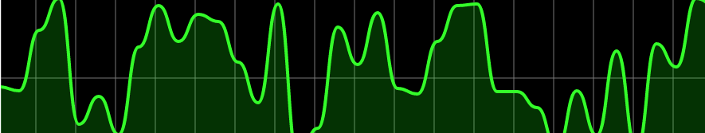
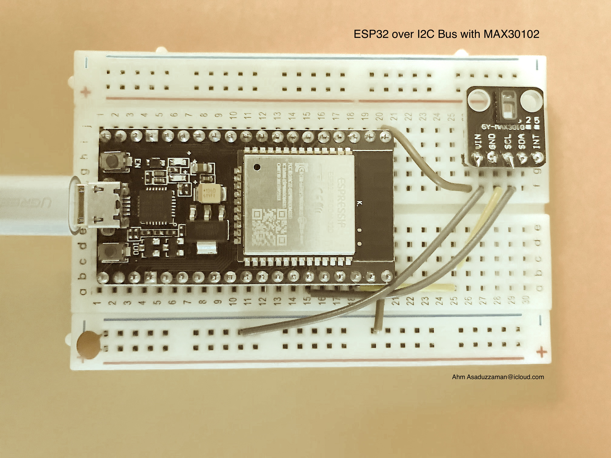
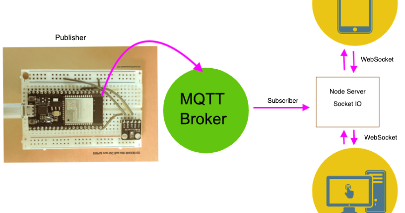
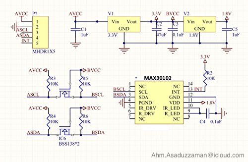

# ESP32-WROOM-32D - Espressif- and MAX30102 High-Sensitivity Pulse Oximeter and Heart-Rate Sensor

## Product  

## Pin Configuration  

# Connectivity  
## ◯ ESP32 + MAX30102 ⇨ ◯ MQTT ⇨ ◯ Node Server + SocketIO ⇨ ◯ Browser  

## MAX30102  

## How It Works  

[How It Works!](https://github.com/ObjectMatrix/max3010xboard/blob/main/howitworks.md)

## ThingSpeak spO2 plot. 
https://thingspeak.com/channels/1229902

