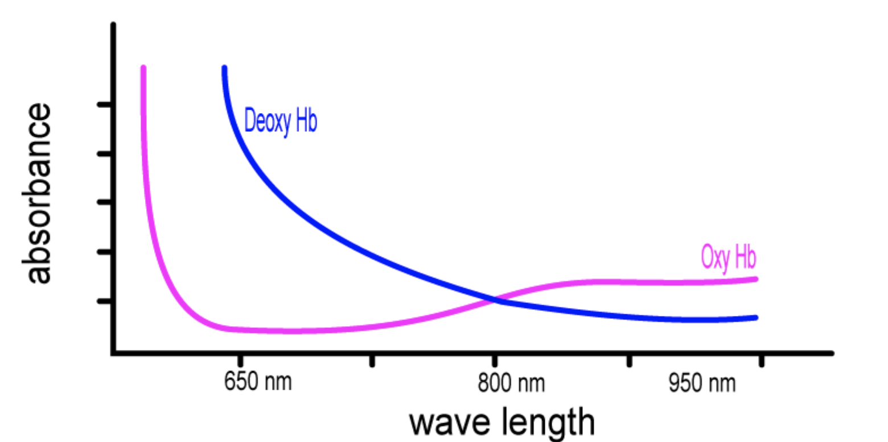

# How it works

## Arteries  
Arteries: blood delivery to tissues and organs 
Veins: blood return to the heart 

## Hemoglobin  
The hemoglobin without oxygen we will call `de oxygenated` hemoglobin (`deoxy Hb`).  
The hemoglobin with oxygen, we will call `oxygenated` hemoglobin (`oxy Hb`).

## Beer's Law (aka, Beer-Lambert Law)
Beer's Law states that the concentration of a chemical solution is directly proportional to its absorption of light.

### Light Absorption in Finger
The light emitted from the source has to travel through the artery. The light travels in a shorter path in the narrow artery and travels through a longer path in the wider artery ( paths are shown as green lines below). Though the concentration of Hb is the same in both arteries, the light meets more Hb in the wider artery, since it travels in a longer path. Therefore, longer the path the light has to travel, more is the light absorbed.

The distance between the “tips” of the waves is equal to the wavelength.

## OxyHb vs DeoxyHb 

Now let us see the absorbance graph of OxyHb and the absorbance graph of DeoxyHb together so we can compare them.  
Note how each of them absorbs light of different wavelengths very differently.

## Inventor
### Takuo Aoyagi—a Tribute to the Brain Behind Pulse Oximetry. 
[a link](https://www.ncbi.nlm.nih.gov/pmc/articles/PMC7237228/)

# Connectivity  
## ◯ ESP32 + MAX30102 ⇨ ◯ MQTT ⇨ ◯ Node Server + SocketIO ⇨ ◯ Browser  

